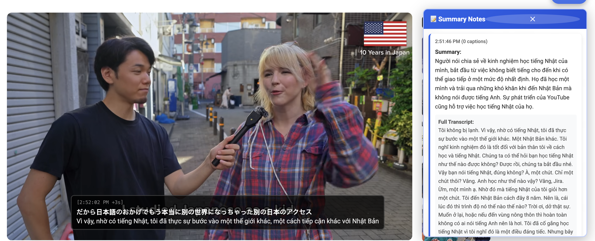

# Live Captions Translator (Vibe Coding Project)

[](https://opensource.org/licenses/MIT)
[](https://chrome.google.com/webstore)

A powerful Chrome extension that captures audio from browser tabs or microphone, transcribes and translates it in real-time using Google Gemini AI, and displays live captions with automated summaries.



> https://www.youtube.com/watch?v=W9GEDe3O5ug

## ✨ Features

- 🎙️ **Audio Recording**: Record from browser tabs
- 🌍 **Real-time Translation**: Instant transcription and translation to multiple languages
- 📝 **Live Captions**: Draggable overlay with timestamps and latency tracking
- 📊 **Automated Summaries**: AI-generated summaries at configurable intervals
- 🔄 **Multi-API Key Support**: Round-robin load balancing across multiple Gemini API keys
- ⚙️ **Customizable Settings**: Configure chunk time, summary intervals, and conversation style
- 🎨 **User-Friendly Interface**: Clean, modern UI with drag-and-drop panels
- 🚧 **Microphone Support**: Coming soon...

## 🚀 Installation

### From Source

1. Clone this repository:

```bash
git clone https://github.com/levohuutri/chrome-extension-live-recorder-translate.git
cd chrome-extension-live-recorder-translate
```

2. Open Chrome and navigate to `chrome://extensions/`

3. Enable "Developer mode" (toggle in top-right corner)

4. Click "Load unpacked" and select the extension directory

5. Get your Gemini API key(s) from [Google AI Studio](https://makersuite.google.com/app/apikey)

### From Chrome Web Store

_Coming soon..._

## 📖 Usage

### Basic Setup

1. Click the extension icon in your Chrome toolbar
2. Enter your Gemini API key(s) (one per line for multiple keys)
3. Select your preferred language (English, Japanese, Vietnamese)
4. Configure audio source (Tab Audio only - Microphone coming soon)

### Starting a Recording Session

1. Navigate to any webpage with audio/video content (YouTube, Netflix, etc.)
2. Click "Start" in the extension popup
3. Live captions will appear on the page automatically
4. Click "📝 Notes" button to view automated summaries

### Customization Options

- **Chunk Time** (3-20s): How often to send audio for transcription
- **Note Time** (15-120s): Interval for generating automated summaries
- **Conversation Style**: Custom instructions for translation style (e.g., "formal and professional", "casual and friendly")

### Using Summaries

- Click the "📝 Notes" button to view automated summaries
- Each summary includes:
  - Brief overview of main points
  - Complete transcript of all captions in that interval
- Summaries are generated in your selected language

## 🛠️ Technical Details

### Architecture

- **Manifest V3**: Modern Chrome extension architecture
- **Service Worker**: Background processing and API calls
- **Offscreen Document**: Audio capture via Web Audio API
- **Content Script**: UI rendering and user interactions
- **AudioWorklet**: Real-time 16kHz PCM audio processing

### API Integration

- **Gemini 2.5 Flash Lite**: Fast, efficient transcription and translation
- **Round-Robin Algorithm**: Automatic load balancing across multiple API keys
- **WAV Encoding**: 16kHz mono PCM for optimal Gemini processing

### Key Technologies

- Chrome Extension APIs (tabCapture, offscreen, storage)
- Web Audio API with AudioWorklet
- Native `getUserMedia()` for microphone access
- PNG icons for crisp rendering at all sizes

## 🔧 Configuration

### Audio Settings

```javascript
// Default values in background.js
chunkTime: 10,  // seconds between transcriptions
noteTime: 30,   // seconds between summaries
```

### Language Support

Currently supports:

- English
- Japanese
- Vietnamese

_More languages can be added in `popup.html`_

### Conversation Styles

Examples you can use:

- `"formal and professional tone"`
- `"friendly and casual"`
- `"educational and clear"`
- `"trang trọng, lịch sự"` (Vietnamese)
- `"親しみやすく、カジュアル"` (Japanese)

## 📁 Project Structure

```
chrome-extension-recorder/
├── manifest.json           # Extension configuration
├── background.js           # Service worker (API calls, state management)
├── popup.html/js          # Extension popup UI
├── content.js             # Caption overlay and notes panel
├── offscreen.html/js      # Audio capture handler
├── pcm-worklet.js         # AudioWorklet processor
├── wav.js                 # WAV encoder
├── styles.css             # UI styling
├── icon*.png              # Extension icons
└── README.md              # This file
```

## 🤝 Contributing

Contributions are welcome! Please feel free to submit a Pull Request.

### Development Setup

1. Fork the repository
2. Create your feature branch (`git checkout -b feature/AmazingFeature`)
3. Commit your changes (`git commit -m 'Add some AmazingFeature'`)
4. Push to the branch (`git push origin feature/AmazingFeature`)
5. Open a Pull Request

### Guidelines

- Follow existing code style
- Test thoroughly before submitting
- Update documentation as needed
- Add comments for complex logic

## 🐛 Known Issues

- Some websites may block content script injection
- First transcription may take longer (API cold start)
- Tab capture may not work on Chrome internal pages (chrome://, chrome-extension://)

## 🗺️ Roadmap

### In Progress

- [ ] **Microphone input support** - Record and transcribe from system microphone
- [ ] **Text-to-Speech (TTS)** - Audio playback of translated captions

### Planned Features

- [ ] Support for more languages
- [ ] Export summaries to file (TXT, PDF)
- [ ] Adjustable caption font size and position
- [ ] Keyboard shortcuts for quick controls
- [ ] Dark mode theme
- [ ] Browser action badge with recording status
- [ ] Custom vocabulary/terminology support
- [ ] Multiple caption display modes (overlay, sidebar, popup)

## 📄 License

This project is licensed under the MIT License - see below for details:

```
MIT License

Copyright (c) 2025 levohuutri (TriLVH92)

Permission is hereby granted, free of charge, to any person obtaining a copy
of this software and associated documentation files (the "Software"), to deal
in the Software without restriction, including without limitation the rights
to use, copy, modify, merge, publish, distribute, sublicense, and/or sell
copies of the Software, and to permit persons to whom the Software is
furnished to do so, subject to the following conditions:

The above copyright notice and this permission notice shall be included in all
copies or substantial portions of the Software.

THE SOFTWARE IS PROVIDED "AS IS", WITHOUT WARRANTY OF ANY KIND, EXPRESS OR
IMPLIED, INCLUDING BUT NOT LIMITED TO THE WARRANTIES OF MERCHANTABILITY,
FITNESS FOR A PARTICULAR PURPOSE AND NONINFRINGEMENT. IN NO EVENT SHALL THE
AUTHORS OR COPYRIGHT HOLDERS BE LIABLE FOR ANY CLAIM, DAMAGES OR OTHER
LIABILITY, WHETHER IN AN ACTION OF CONTRACT, TORT OR OTHERWISE, ARISING FROM,
OUT OF OR IN CONNECTION WITH THE SOFTWARE OR THE USE OR OTHER DEALINGS IN THE
SOFTWARE.
```

## 🙏 Acknowledgments

- Google Gemini AI for powerful transcription and translation
- Chrome Extensions team for excellent documentation
- Open source community for inspiration and support

## 📧 Contact

- **Issues**: Please use the [GitHub Issues](https://github.com/levohuutri/chrome-extension-live-recorder-translate/issues) page
- **GitHub**: [@levohuutri](https://github.com/levohuutri)

## ⭐ Show Your Support

If you find this project helpful, please give it a ⭐ on GitHub!

---

**Made with ❤️ by levohuutri (TriLVH92)**
